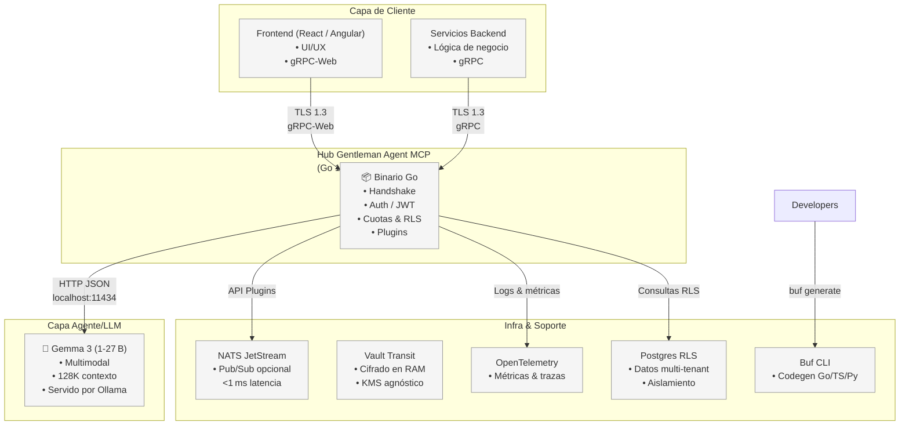

# Gentleman Agent MCP Gateway

[](https://golang.org/)
[](https://grpc.io/)
[](https://ollama.com/)
[](./LICENSE)
[]()

> **Plug your app into any agent or LLM in 5 minutes—without touching your stack
> or paying per‑token fees.**

**🎬 Live Demo (Sprint 1 + 2):**
```bash
# Terminal 1: Start gateway
make dev-insecure

# Terminal 2: Test streaming chat (NEW!)
./bin/mcp-stream-client -insecure
# ✅ Registration successful!
# ✅ Streaming session started!
# 💬 You: Hello Gemma!
# 🤖 Gemma: Hello there! It's lovely to hear from you. 😊
# 💬 You: quit
```

## 🚀 The idea in 30 seconds

The AI‑agent boom is fracturing development: every provider ships its own SDK,
its own auth scheme and its own token pricing. **Gentleman Agent MCP** is the
_universal Gateway_—a tiny Go binary that sits between your code and any agent
(local Gemma 3, OpenAI, Anthropic, your fine‑tuned model…) and takes care of
everything for you:

- **Stack‑agnostic connection** — your micro‑services speak gRPC; your frontend,
  gRPC‑Web or WebSocket; Gentleman Agent MCP translates and routes.
- **Enterprise‑grade security** — TLS 1.3, 5‑minute JWTs, optional mTLS and
  in‑RAM encryption via Vault Transit.
- **Cost control** — run Gemma 3 locally via Ollama while developing and burst
  to the cloud only when needed.
- **Effortless scale** — goroutines and optional NATS: thousands of concurrent
  agents with < 1 ms latency.
- **Premium DX** — `agent-mcp gen` spits out Go/TS/Py stubs, React hooks and
  Angular services ready to consume.

In short: **one entry point, 100 % open‑core, built for pragmatic devs who want
speed today and governance tomorrow.**

> **Micro‑Connection‑Protocol (MCP)** – a lightweight, language‑agnostic
> contract that lets _any_ app talk to _any_ agent/LLM through a single, secure
> gateway.

---

## ✨ Why Gentleman Agent MCP + Gemma 3?

- **Vendor‑neutral** – one contract for _Gemma 3_, OpenAI, Anthropic or an
  in‑house agent.
- **Zero retention** – prompts/responses live only in RAM; metrics are
  aggregated and anonymised.
- **Performance by Go 1.22** – static binaries < 10 MB, goroutines handle
  thousands of concurrent streams efficiently
  ([mojoauth.com](https://mojoauth.com/news/unlocking-the-future-of-golang-trends-predictions-and-business-impact-in-2025?utm_source=chatgpt.com)).
- **Runs on your laptop** – Gemma 3 4 B needs ≈8 GB VRAM; 1 B even less, so no
  cloud fee
  ([ollama.com](https://ollama.com/library/gemma3?utm_source=chatgpt.com)).
- **Multimodal & 128 K context** – image + text input and long conversations out
  of the box
  ([ai.google.dev](https://ai.google.dev/gemma/docs/core?utm_source=chatgpt.com),
  [blog.google](https://blog.google/technology/developers/gemma-3/?utm_source=chatgpt.com)).
- **DX first** – `agent-mcp gen` auto‑generates stubs for Go, TypeScript and
  Python using Buf
  ([tip.golang.org](https://tip.golang.org/doc/go1.22?utm_source=chatgpt.com)).
- **Multi‑tenant** – built‑in `tenant_id`, JWT scopes, quotas and Postgres Row
  Level Security
  ([aws.amazon.com](https://aws.amazon.com/blogs/database/multi-tenant-data-isolation-with-postgresql-row-level-security/?utm_source=chatgpt.com)).

---

## 🗺️ High‑Level Architecture


- **Handshake** – app registers with `tenant_id`, JWT, chosen `model`.
- **Chat** – bidirectional `ChatMessage` stream with back‑pressure.
- **Plugins** – extra transports (NATS/MQTT) via HashiCorp `go-plugin`
  ([bravenewgeek.com](https://bravenewgeek.com/benchmarking-message-queue-latency/?utm_source=chatgpt.com)).

---

## ⚙️ Core Technologies

| Layer                  | Tech                   | Why it matters                                                                                                                                                                                                    |
| ---------------------- | ---------------------- | ----------------------------------------------------------------------------------------------------------------------------------------------------------------------------------------------------------------- |
| Runtime                | **Go 1.22**            | Generics and PGO for runtime performance ([mojoauth.com](https://mojoauth.com/news/unlocking-the-future-of-golang-trends-predictions-and-business-impact-in-2025?utm_source=chatgpt.com))                         |
| Protocol               | **gRPC + Protobuf**    | HTTP/2 multiplex + multi‑language code‑gen                                                                                                                                                                        |
| Local LLM              | **Gemma 3 (1 B‑27 B)** | Multimodal, 128 K context, open license ([ai.google.dev](https://ai.google.dev/gemma/docs/core?utm_source=chatgpt.com), [blog.google](https://blog.google/technology/developers/gemma-3/?utm_source=chatgpt.com)) |
| Runtime host           | **Ollama ≥ 0.6**       | Pull `ollama run gemma3:4b` – zero token cost ([ollama.com](https://ollama.com/library/gemma3?utm_source=chatgpt.com))                                                                                            |
| Code‑gen               | **Buf**                | Single `buf.gen.yaml` generates Go/TS/Py stubs ([tip.golang.org](https://tip.golang.org/doc/go1.22?utm_source=chatgpt.com))                                                                                       |
| Observability          | **OpenTelemetry**      | gRPC instrumentation via `otelgrpc` ([pkg.go.dev](https://pkg.go.dev/go.opentelemetry.io/contrib/instrumentation/google.golang.org/grpc/otelgrpc?utm_source=chatgpt.com))                                         |
| Security               | **TLS 1.3 / mTLS**     | Forward secrecy for every session ([blogs.cisco.com](https://blogs.cisco.com/security/tls-1-3-and-forward-secrecy-count-us-in-and-heres-why?utm_source=chatgpt.com))                                              |
| In‑process encryption  | **Vault Transit**      | Encrypt/decrypt in RAM only ([ai.google.dev](https://ai.google.dev/gemma/docs/integrations/ollama?utm_source=chatgpt.com))                                                                                        |
| Multi‑tenant isolation | **Postgres RLS**       | Enforces `tenant_id` at DB tier ([aws.amazon.com](https://aws.amazon.com/blogs/database/multi-tenant-data-isolation-with-postgresql-row-level-security/?utm_source=chatgpt.com))                                  |
| Low‑latency transport  | **NATS**               | Sub‑millisecond pub/sub for thousands of agents ([bravenewgeek.com](https://bravenewgeek.com/benchmarking-message-queue-latency/?utm_source=chatgpt.com))                                                         |

---

## 🔒 Security & Compliance

- **TLS 1.3 mandatory; mTLS optional** for enterprise.
- **JWT lifespan ≤ 5 min** with refresh to minimise replay risk.
- **Vault Transit** encrypts payloads; plaintext never touches disk.
- **Row Level Security** + opaque `tenant_id` isolates data.
- **Logs scrubbed** – payload fields are removed per OWASP guidance.

---

## 🚀 Roadmap (12 sprints / 3 months)

| Sprint | Objective                        | Key deliverables                               |
| ------ | -------------------------------- | ---------------------------------------------- |
| **0**  | RFC & setup                      | `mcp.proto` v0, CI (Go 1.22 + Buf + linters)   |
| **1**  | Core Go + TLS                    | Secure gRPC server                             |
| **2**  | Integrate **Gemma 3** via Ollama | Wrapper HTTP, local demo                       |
| **3**  | gRPC‑Web + FE hooks              | Proxy h2c + `useAgent` / `AgentService`        |
| **4**  | CLI `agent-mcp gen`              | Generate Go/TS/Py stubs                        |
| **5**  | Auth & multi‑tenant              | JWT, quotas, Postgres RLS                      |
| **6**  | Observability                    | OTel export to Prometheus dashboards           |
| **7**  | Plugins & NATS                   | `nats-transport` plugin, load test 10 k agents |
| **8**  | Vault Transit                    | In‑process encryption, key rotation            |
| **9**  | RBAC & quotas                    | Enterprise features, billing API               |
| **10** | Performance tuning               | p99 < 50 ms benchmarks                         |
| **11** | Compliance                       | Zero‑retention tests, GDPR docs                |
| **12** | SaaS dashboard                   | Multi‑tenant UI, Stripe metering, public beta  |

---

## 🏁 Quick Start (Sprint 1 Demo)

### Prerequisites
```bash
# Install dependencies
brew install go buf grpcurl  # macOS
# or
sudo apt install golang-go grpcurl && go install github.com/bufbuild/buf/cmd/buf@latest  # Linux

# Install Bun (faster package manager for web development)
curl -fsSL https://bun.sh/install | bash

# Install & setup Ollama
curl -fsSL https://ollama.com/install.sh | sh
ollama pull gemma3:4b
ollama serve &  # Keep running in background
```

### Option A: Full TLS Demo (Recommended)
```bash
# 1. Clone and setup
git clone https://github.com/Gentleman-Programming/gentleman-mcp.git
cd gentleman-mcp

# 2. Setup complete environment (includes Bun)
make setup

# 3. Start secure server with gRPC-Web
./bin/gentleman-mcp -enable-web

# 4. Start React app (in another terminal)
make web-dev

# 5. Open browser: http://localhost:3000
```

**Expected output:**
```
🚀 Gentleman MCP Gateway Client
📡 Connecting to: localhost:50051
🔐 TLS: true (mTLS: false)

1️⃣ Registering with gateway...
✅ Registration successful!
   📋 Session ID: ad993022704e1b88...
   🎫 JWT Token: e9fed7749344a12d...

2️⃣ Authenticating token...
✅ Authentication successful!

3️⃣ Sending chat message...
   💬 Message: Hello Gemma! How are you today?
✅ Response received!
   🤖 Gemma: Hello there! I'm doing quite well...

🎉 Demo completed successfully!
```

### Option B: Quick Web Test (Insecure)
```bash
# 1. Start server with gRPC-Web (no TLS)
make dev-web

# 2. Start React development server
make web-dev

# 3. Open browser to test web interface
open http://localhost:3000

# 4. Or test with grpcurl
grpcurl -plaintext \
  -d '{"tenant_id":"demo","agent_id":"test","model":"gemma3:4b"}' \
  localhost:50051 mcp.v1.HandshakeService/Register
```

### Advanced Testing Scenarios

**🔒 Test mTLS (Mutual TLS):**
```bash
# Start server with mTLS
./bin/gentleman-mcp -mtls

# Connect with client certificate
./bin/mcp-client -mtls
```

**🔍 Load Testing:**
```bash
# Multiple concurrent sessions
for i in {1..10}; do
  ./bin/mcp-client -insecure &
done
wait

# Streaming load test
for i in {1..5}; do
  echo -e "Hello from session $i\nquit" | ./bin/mcp-stream-client -insecure &
done
wait
```

**🔍 Health Check:**
```bash
# Check system status (includes Bun)
make status

# Setup web development only
make setup-web

# Clean and rebuild web app
make web-clean && make web-install

# View server logs
make logs
```

### Troubleshooting

**Ollama not responding:**
```bash
# Check Ollama status
make ollama-test

# Restart Ollama
ollama serve

# Verify model
ollama list | grep gemma3
```

**Certificate issues:**
```bash
# Regenerate certificates
make certs-clean && make certs

# Test without TLS
./bin/gentleman-mcp -insecure
```

**Port conflicts:**
```bash
# Check if port 50051 is in use
lsof -i :50051

# Use different port
./bin/gentleman-mcp -port 50052
```

---

## 🧪 Compatibility & Testing

### Sprint Progress
| Sprint | Status | Features |
|--------|--------|----------|
| **Sprint 1** | ✅ **COMPLETE** | Core Go + TLS, HandshakeService, AgentService, Example Client |
| **Sprint 2** | ✅ **COMPLETE** | Bidirectional streaming chat, enhanced Ollama integration, interactive client |
| **Sprint 3** | 🔄 Ready | gRPC-Web proxy + frontend hooks (React/Angular) |

### Tested Configurations
| Component | Version | Status | Notes |
|-----------|---------|---------|-------|
| **Go** | 1.22+ | ✅ Working | With generics and PGO support |
| **Bun** | 1.0+ | ✅ Working | Fast package manager, 2-10x faster than npm |
| **Ollama** | 0.6+ | ✅ Working | Gemma 3 (1B-27B models) |
| **gRPC** | Latest | ✅ Working | TLS 1.3, HTTP/2, reflection enabled |
| **Buf** | 1.55+ | ✅ Working | Proto generation and linting |
| **TLS** | 1.3 | ✅ Working | Forward secrecy, mTLS optional |

### Platform Support
- ✅ **macOS** (Intel & Apple Silicon)
- ✅ **Linux** (x86_64, ARM64)
- 🔄 **Windows** (untested, should work)
- 🔄 **Docker** (containerization ready)

---

## 🛠️ Development Workflow

### Sprint 1 Status: ✅ COMPLETED
**Core Go + TLS - Secure gRPC server**

✅ **Implemented Features:**
- Secure gRPC server with TLS 1.3 support
- HandshakeService for authentication & session management
- AgentService with Gemma 3 integration via Ollama
- Development certificates generation
- Example client with TLS support
- Complete Makefile for development workflow

### Sprint 2 Status: ✅ COMPLETED
**Bidirectional Streaming Chat & Enhanced Ollama Integration**

✅ **Implemented Features:**
- Real-time bidirectional streaming chat via gRPC
- Session management for active streams
- Interactive chat client with commands (help, quit, status)
- Enhanced Ollama client with context support
- Automatic cleanup of inactive sessions
- Robust error handling and timeouts

✅ **Test Results:**
```bash
# Streaming chat demo:
make dev-insecure          # Terminal 1
make stream-client-insecure # Terminal 2
# → Registration ✅
# → Streaming session ✅
# → Real-time chat with Gemma 3 ✅
# → Interactive commands ✅
```

### Development Commands

**Essential Commands:**
```bash
make help          # Show all available commands
make status        # Check development environment
make setup         # Complete initial setup
make dev           # Start server with TLS
make dev-insecure  # Start server without TLS
make client        # Run example client
```

**Code Generation:**
```bash
make proto         # Generate Go code from .proto files
make proto-lint    # Lint protobuf definitions
make build         # Build production binary
make build-client  # Build example client
make web-build     # Build React app with Bun
```

**Testing & Quality:**
```bash
make test          # Run unit tests
make smoke-test    # Quick functional test
make lint          # Run Go linter
make fmt           # Format Go code
make check         # Run all checks (lint + test + proto-lint)
```

**TLS Certificate Management:**
```bash
make certs         # Generate development certificates
make certs-clean   # Remove all certificates
```

**Web Development (Bun):**
```bash
make install-bun   # Install Bun package manager
make web-install   # Install React dependencies with Bun
make web-dev       # Start React dev server (faster than npm)
make web-build     # Build for production
make web-test      # Run tests with Bun
make web-clean     # Clean cache and dependencies
```

**Ollama Integration:**
```bash
make ollama-setup  # Install and configure Gemma 3
make ollama-start  # Start Ollama service
make ollama-test   # Test Ollama connection
```

### Next: Sprint 3
Ready to implement:
- **Sprint 3**: gRPC-Web proxy + frontend hooks (React/Angular)
- **Sprint 4**: CLI code generation (`agent-mcp gen`)

---

## 🤝 Contributing

1. Fork & create a feature branch.
2. `make test && make lint` must pass.
3. Open a PR; core team reviews within 48 h.

---

## 📄 License

Apache‑2.0 for the core; Enterprise modules under BSL‑1.1.

---

Made with ❤️ by the Gentleman Agent MCP team.

---

## 🇪🇸 Versión en Español

## Gentleman Agent MCP Gateway

> **Conecta tu app con cualquier agente o LLM en 5 minutos—sin modificar tu
> stack ni pagar tarifas por token.**

## 🚀 La idea en 30 segundos

El auge de los agentes de IA está fragmentando el desarrollo: cada proveedor
distribuye su propio SDK, su propio esquema de autenticación y su propia
estructura de precios. **Gentleman Agent MCP** es la _Pasarela Universal_: un
pequeño binario Go que se sitúa entre tu código y cualquier agente (Gemma 3
local, OpenAI, Anthropic, tu propio modelo…) y se encarga de todo:

- **Conexión agnóstica al stack** — tus microservicios usan gRPC; tu frontend,
  gRPC-Web o WebSocket; Gentleman Agent MCP traduce y enruta.
- **Seguridad empresarial** — TLS 1.3, JWTs de 5 minutos, mTLS opcional y
  cifrado en RAM vía Vault Transit.
- **Control de costos** — ejecuta Gemma 3 localmente con Ollama durante el
  desarrollo y escala a la nube solo cuando sea necesario.
- **Escalabilidad sencilla** — goroutines y NATS opcional: miles de agentes
  concurrentes con latencia < 1 ms.
- **Excelencia para desarrolladores** — `agent-mcp gen` genera stubs Go/TS/Py,
  hooks de React y servicios Angular listos para usar.

En resumen: **un punto de entrada, 100 % open-core, pensado para devs
pragmáticos que buscan velocidad hoy y gobernanza mañana**.

> **Micro-Connection-Protocol (MCP)** – un contrato liviano y agnóstico de
> lenguaje que permite que _cualquier_ app hable con _cualquier_ agente/LLM a
> través de una pasarela segura.

---

## ✨ ¿Por qué Gentleman Agent MCP + Gemma 3?

- **Neutralidad de proveedor** – un contrato para _Gemma 3_, OpenAI, Anthropic o
  un agente propio.
- **Sin retención** – los prompts y respuestas viven solo en RAM; las métricas
  se agregan y anonimizan.
- **Rendimiento (Go 1.22)** – binarios estáticos <10 MB; goroutines gestionan
  miles de flujos concurrentes eficientemente.
- **Corre en tu laptop** – Gemma 3 4B requiere ≈8 GB VRAM; 1B aún menos, sin
  costos de nube.
- **Multimodalidad y contexto 128K** – imagen + texto y conversaciones largas
  desde el inicio.
- **DX primero** – `agent-mcp gen` autogenera stubs para Go, TS y Py usando Buf.
- **Multi-tenant** – `tenant_id` integrado, JWTs con scopes, cuotas y RLS en
  Postgres.

---

## 🗺️ Arquitectura de Alto Nivel



- **Handshake** — La app se registra con `tenant_id`, JWT y el modelo elegido.
- **Chat** — Stream bidireccional `ChatMessage` con control de presión
  (back-pressure).
- **Plugins** — Transportes extra (NATS/MQTT) vía HashiCorp `go-plugin`.

---

## ⚙️ Tecnologías Clave

| Capa                     | Tecnología           | Por qué importa                                                                                                                                                                                                       |
| ------------------------ | -------------------- | --------------------------------------------------------------------------------------------------------------------------------------------------------------------------------------------------------------------- |
| Runtime                  | **Go 1.22**          | Genéricos y PGO para rendimiento ([mojoauth.com](https://mojoauth.com/news/unlocking-the-future-of-golang-trends-predictions-and-business-impact-in-2025?utm_source=chatgpt.com))                                     |
| Protocolo                | **gRPC + Protobuf**  | HTTP/2 multiplexado + codegen multi-lenguaje.                                                                                                                                                                         |
| LLM Local                | **Gemma 3 (1B-27B)** | Multimodal, contexto 128K, licencia abierta ([ai.google.dev](https://ai.google.dev/gemma/docs/core?utm_source=chatgpt.com), [blog.google](https://blog.google/technology/developers/gemma-3/?utm_source=chatgpt.com)) |
| Host de runtime          | **Ollama ≥ 0.6**     | `ollama run gemma3:4b` – sin tokens ([ollama.com](https://ollama.com/library/gemma3?utm_source=chatgpt.com))                                                                                                          |
| Codegen                  | **Buf**              | Un solo `buf.gen.yaml` genera stubs Go/TS/Py ([tip.golang.org](https://tip.golang.org/doc/go1.22?utm_source=chatgpt.com))                                                                                             |
| Observabilidad           | **OpenTelemetry**    | Instrumentación gRPC vía `otelgrpc` ([pkg.go.dev](https://pkg.go.dev/go.opentelemetry.io/contrib/instrumentation/google.golang.org/grpc/otelgrpc?utm_source=chatgpt.com))                                             |
| Seguridad                | **TLS 1.3 / mTLS**   | Previsión hacia adelante en cada sesión ([blogs.cisco.com](https://blogs.cisco.com/security/tls-1-3-and-forward-secrecy-count-us-in-and-heres-why?utm_source=chatgpt.com))                                            |
| Cifrado en proceso       | **Vault Transit**    | Cifrado/desifrado solo en RAM ([ai.google.dev](https://ai.google.dev/gemma/docs/integrations/ollama?utm_source=chatgpt.com))                                                                                          |
| Aislamiento multi-tenant | **Postgres RLS**     | Enforcea `tenant_id` a nivel BD ([aws.amazon.com](https://aws.amazon.com/blogs/database/multi-tenant-data-isolation-with-postgresql-row-level-security/?utm_source=chatgpt.com))                                      |
| Transporte baja latencia | **NATS**             | Pub/sub sub-milisegundos para miles de agentes ([bravenewgeek.com](https://bravenewgeek.com/benchmarking-message-queue-latency/?utm_source=chatgpt.com))                                                              |

---

## 🔒 Seguridad y Cumplimiento

- **TLS 1.3 obligatorio; mTLS opcional** para empresas.
- **JWT ≤ 5 min** de vida, con refresh para minimizar riesgos de replay.
- **Vault Transit** cifra los payloads; el texto plano nunca llega a disco.
- **Row Level Security** + `tenant_id` opaco aíslan los datos.
- **Logs anonimizados** — los campos de payload se eliminan siguiendo OWASP.

---

## 🚀 Hoja de Ruta (12 sprints / 3 meses)

| Sprint | Objetivo                        | Entregables clave                             |
| ------ | ------------------------------- | --------------------------------------------- |
| **0**  | RFC & setup                     | `mcp.proto` v0, CI (Go 1.22 + Buf + linters)  |
| **1**  | Core Go + TLS                   | Servidor gRPC seguro                          |
| **2**  | Integrar **Gemma 3** vía Ollama | Wrapper HTTP, demo local                      |
| **3**  | gRPC-Web + hooks FE             | Proxy h2c + `useAgent` / `AgentService`       |
| **4**  | CLI `agent-mcp gen`             | Generar stubs Go/TS/Py                        |
| **5**  | Auth & multi-tenant             | JWT, cuotas, Postgres RLS                     |
| **6**  | Observabilidad                  | Export OTel a dashboards Prometheus           |
| **7**  | Plugins & NATS                  | Plugin nats-transport, test carga 10k agentes |
| **8**  | Vault Transit                   | Cifrado en proceso, rotación de claves        |
| **9**  | RBAC & cuotas                   | Enterprise features, API de cobro             |
| **10** | Optimización rendimiento        | Benchmarks p99 < 50ms                         |
| **11** | Cumplimiento                    | Tests sin retención, docs GDPR                |
| **12** | Dashboard SaaS                  | UI multi-tenant, métrica Stripe, beta pública |

---

## 🏁 Inicio Rápido (modo desarrollador)

```bash
# Requisitos
brew install go buf   # o apt en Linux
curl -fsSL https://ollama.com/install.sh | sh
ollama pull gemma3:4b && ollama serve &

# Clona y ejecuta el hub
git clone https://github.com/your-org/agent-mcp.git && cd agent-mcp
make dev  # compila y arranca el hub en :50051

# Prueba básica
grpcurl -plaintext \
  -d '{"agent_id":"demo","content":"Hola Gemma"}' \
  localhost:50051 mcp.AgentService/Chat
```

---

## 🤝 Contribuir

1. Haz fork y crea una rama de feature.
2. Deben pasar `make test && make lint`.
3. Abre un PR; el core team revisa en menos de 48 h.

---

## 📄 Licencia

Apache‑2.0 para el core; módulos Enterprise bajo BSL-1.1.

---

Hecho con ❤️ por el equipo de Gentleman Agent MCP.
